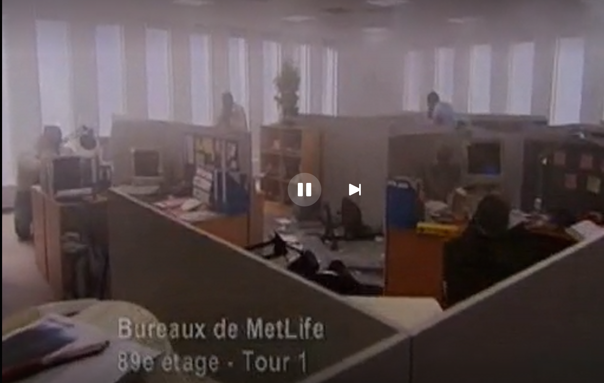
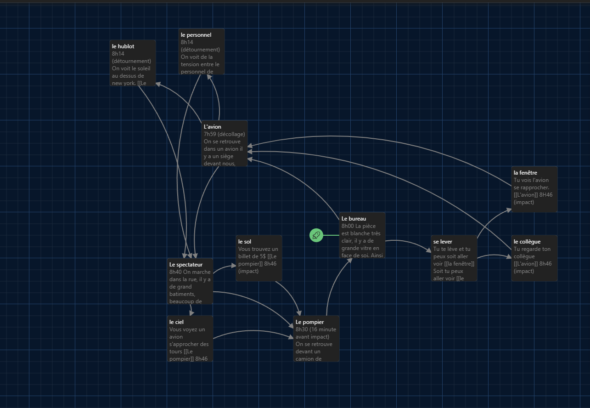
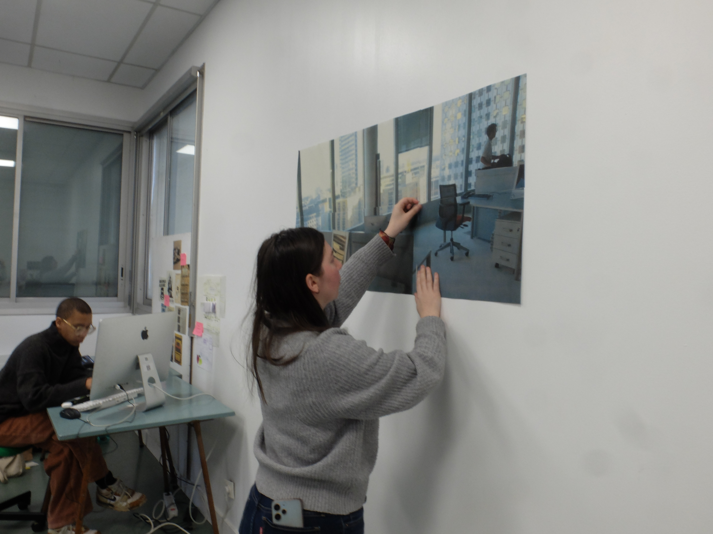
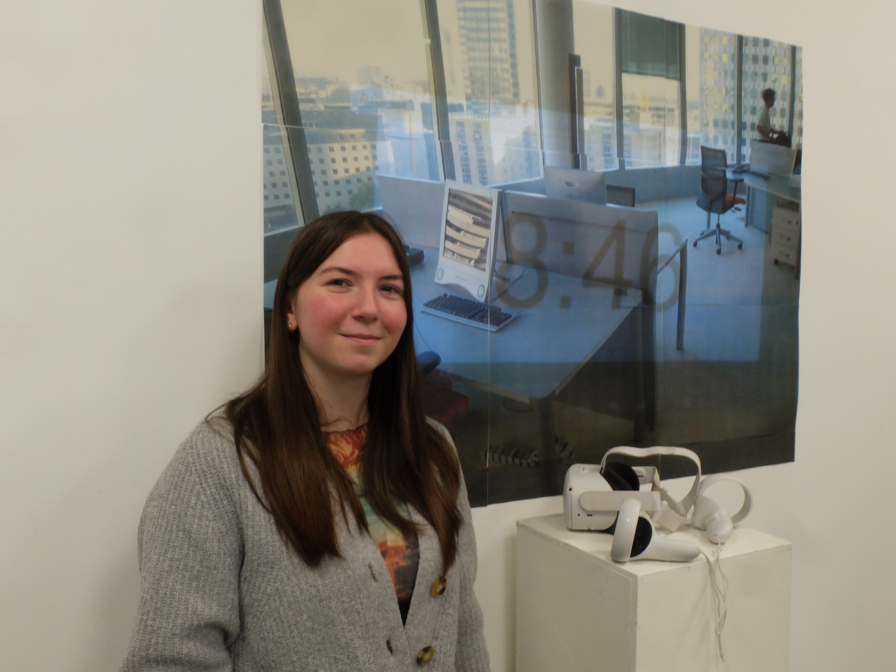

# Fiche Pédagogique

**Informations Étudiant**

- **Nom : AMIOT**
- **Prénom : Manon**

**Présentation Personnelle**

J'ai fait un DNMADE numérique à Yzeure (03) avant d'intégrer l’ESAD. Pendant mon DNMADE, j'ai fait une liste d'objets et de choses qui me tenaient à cœur. Très vite, je me suis rendu compte que je m'intéressais au voyage dans le temps, mais surtout au fait d'en apprendre plus sur le passé et de transmettre des choses au futur. J'ai écrit un mémoire dans lequel j'ai expérimenté autour de différents sujets : la transmission de notre mémoire familiale par nos aînés, l'apprentissage auprès des plus jeunes et enfin rassembler les anciens et la nouvelle génération autour d'un événement qui les marquent tous. Pour cela, j'ai décidé de m'intéresser aux événements du 11 septembre 2001, puisque nous remontons dans le temps chaque 11 septembre par le biais des commémorations et des posts sur les réseaux sociaux. Pourtant, je connais très bien cet événement sans même l'avoir vécu, mais je ne connais pas le ressenti de cette journée, d'aucun point de vue.

# **## PROJETS**

# **Projet 1**

**Sujet de Projet**

- **Titre du projet : 8 heures, 46 minutes.**
- **Description du projet (environ 150 mots) :** Ce projet est un jeu vidéo documentaire en réalité virtuelle. Le choix de la VR permet une immersion totale, lui faisant subir le jeu de manière physique et émotionnelle. Le jeu se compose de trois scènes : un bureau, un avion et une rue. Dans un premier temps, le joueur ne comprend pas ce qui se déroule. La narration se construit progressivement, jusqu’à la révélation apportée par la scène de l’avion, qui donne sens à l’ensemble du dispositif. Le jeu porte le nom de **8 heures, 46 minutes**, car le projet fait référence à l’heure précise à laquelle la première tour du World Trade Center a été percutée. Le temps est un élément central du jeu : l’horloge défile de manière visible, afin d'engendrer de la tension, de la confusion et une perception altérée du temps en situation de crise. L’expérience vise à faire ressentir un moment historique à travers différents points de vue et espaces. La forme documentaire interactive cherche à questionner la manière dont un événement est perçu, mémorisé et transmis, en mettant en avant la subjectivité des vécus face à un même fait historique. **À la place de documenter précisément**, je veux que le joueur comprenne de lui-même la temporalité de l'événement et soit documenté par le jeu.

**Thématiques de Recherche**

- **Thématiques que vous souhaitez explorer : Le 11 septembre 2001**
- **Pourquoi cette thématique vous intéresse-t-elle ? (environ 100 mots) :** 
Je veux aborder la thématique du 11 septembre 2001, car c’est un événement tragique qui a marqué le monde. Pour ma part, comme beaucoup de personnes de ma génération, je n’étais pas né et je n'ai que les récits de ma famille pour comprendre comment ils ont vécu l’annonce de cet événement et comment, à travers leurs écrans, à des milliers de kilomètres, ils ont ressenti cette peur face aux images.

Il me paraît important de parler de cet événement, car il existe un avant et un après le 11 septembre 2001, que ce soit en Amérique ou en France. Les points de vue politiques ont complètement changé à la suite de ces événements, modifiant notre rapport à la sécurité, à l’information et au monde.

**Outils et Techniques**

- **Outils que vous comptez utiliser (logiciels, langages de programmation, etc.) : Unity, langage C#.**
- **Techniques spécifiques que vous souhaitez maîtriser ou expérimenter :** Pour ce projet, j’aimerais réaliser un code qui permette de ralentir une animation lorsqu’elle entre dans le champ de vision du joueur, afin d’accentuer la perception du moment et la tension ressentie. J’aimerais également coder un effet de tremblement de caméra au moment où l’avion touche la tour, pour renforcer l’impact de la scène et traduire visuellement et physiquement la violence de l’événement. 

**Références Artistiques**

Pour les références artistiques, Mosa m'a montré un projet de Florent Deloison : https://florentdeloison.fr/projets/glitchboy.html

Pour le concept, je me suis inspiré de l'artiste Bill Viola, avec sa vidéo Tristan's Ascension, dans laquelle on voit un homme (Tristan) remonter de l'eau au ralenti. Pour moi, cette œuvre représente le danger qui nous pousse à ressentir cette sensation de temps étiré. Tout d'abord, Tristan entre dans l'eau fortement et, pour essayer de survivre, le temps se ralentit.

- **Argumentaire expliquant la pertinence de votre projet (environ 150 mots) :**
J'ai voulu créer une réflexion sur la transmission de la mémoire collective et individuelle d’un événement historique. Le 11 septembre 2001 est un événement extrêmement documenté et commémoré, pourtant il est souvent connu à travers des images médiatisées, sans accès au ressenti intime des personnes qui l’ont vécu. La réalité virtuelle permet d'explorer cette dimension sensible, en favorisant l’empathie et l’identification à des vécus multiples.

En plaçant le joueur dans une situation immersive, le projet interroge la perception du temps sous stress, le traumatisme collectif et individuel, ainsi que le lien entre regard, mémoire et peur. Il questionne également le choix de regarder ou de détourner les yeux face à des images violentes, un enjeu central dans notre rapport contemporain à l’information. Ainsi, ce jeu vidéo documentaire propose une autre manière de se souvenir, en faisant de l’expérience vécue un vecteur de transmission mémorielle.
- **Références artistiques qui inspirent votre travail (livres, artistes, œuvres, etc.) :**

Je me suis inspiré du film United 93 de Paul Greengrass.
C'est un film qui traite du 11 septembre par une mise en scène immersive et réaliste, centrée sur la tension, le temps réel et l’expérience humaine plutôt que sur le spectaculaire.

Je me suis aussi inspiré du travail de Christian Boltanski,
qui travaille sur la mémoire, l’absence et le traumatisme collectif, et constitue une référence essentielle pour penser la transmission et la trace.

# **Actions**

**Contribution à un Projet d'Autre Étudiant**

J'ai aidé Armand et Aleyna lors de l'accrochage, je les ai aidés à déplacer leur matériel et à l’installer.

# **Planification**

**Planning de Travail**

- Établissez un planning des étapes clés pour votre projet :
- [x]  **Étape 1 :** Créer un scénario
- [x]  **Étape 2 :** Chercher des assets
- [x]  **Étape 3 :** Modélisé les 3 scènes
- [x]  **Étape 4 :** Créer les transitions
- [x]  **Étape 5 :** Coder le slow motion
- [x]  **Étape 6 :** Créer le timer
- [x]  **Étape 7 :** Créer les tremblements de caméra
- [x]  **Étape 8 :** Exporter le jeu sur casque VR

# **Commentaires et Questions**

J’aurais aimé avoir plus de temps, surtout pour créer mes assets moi-même. Je me suis rendu compte que travailler avec des assets faits par d’autres personnes n'était pas forcément un gain de temps et que le rendu manquait d’harmonie. J’aurais également aimé ajouter du son afin de pousser l’immersion au maximum. Malgré tout, je suis quand même surprise de ce que j’ai pu produire en si peu de temps.

# **Journal de bord**

**Lundi 3 Novembre :**

En premier lieu, j’ai commencé à faire des recherches sur le 11 septembre 2001, notamment des images, vidéos et récits, pour pouvoir comprendre l’ambiance globale de l’événement et avoir des informations réelles, notamment celles du temps entre chaque événement (décollage de l’avion, détournement, impact). J'ai trouvé des images comme l'intérieur des tours et des bureaux. 

**Mardi 4 et vendredi 7 Novembre :** 

Ensuite, j’ai créé un scénario sur Twine qui permet de montrer comment on passe d’une scène à une autre avec les notions de temps réel de l’événement.
Pour le scénario, j'ai commencé par imaginer quatre scènes. Je voulais jongler entre les scènes :
- Le bureau, qui permet de se projeter dans l’un des bureaux d'une des deux tours.
- L'avion, dans lequel on ne fait que ressentir les secousses.
- Le bas des immeubles, où l'on voit la scène en étant impuissant.
- La partie des pompiers, qui arrive après l'incident (que j'ai retirée après réflexion, de peur de manquer de temps).
Je voulais qu'on passe d'une scène à une autre en voyant des choses précises avant l'impact, mais voyant que je n'arriverais pas à tout réaliser dans le temps imparti, j'ai seulement fait une boucle avec les trois scènes principales : celle où l'avion est sur le point de se crasher, celle de la personne dans le bureau qui voit l'avion entrer dans la tour, et celle de la personne en bas qui assiste impuissante à la scène où l'avion se crashe dans la tour.

**Lundi 24, Mardi 25 novembre :** 

J’ai récupéré mes éléments que j'avais utilisés pour le Workshop VR avec Florent Deloison. J'ai aussi cherché d'autres assets et je suis tombé sur un asset entier du World Trade Center avec les avions, la ville en dessous et les avions. Cela m'a beaucoup aidé, car je n'arrivais pas à trouver d'asset d'avion de type Boeing 767 et je voulais quelque chose le plus fidèle possible.

J’ai récupéré pour la scène du bureau un open space que j’avais créé pour un autre projet en VR. Je l'ai modifié pour qu’il corresponde au mieux au bureau du World Trade Center.

J'ai essayé de recréer une rue dans laquelle on peut voir les avions depuis le bas des immeubles.

Et j'ai ajouté des sièges dans l'avion.

**Vendredi 28 Novembre :** 

Le vendredi, j'ai ajouté toutes les scènes dans Unity. Je me suis ensuite retrouvé en difficulté avec les assets que j'avais téléchargés : ils étaient parfois mal rangés et peu fonctionnels (les avions, par exemple, n'étaient pas des blocs joints en une seule pièce, mais un ensemble de petits modules), ce qui m'a fait perdre énormément de temps. Ne voulant pas perdre plus de temps, j'ai laissé les assets que j'avais trouvés tels quels, même s'il y a beaucoup d'incohérences et que, si j'avais pu créer moi-même tous mes éléments, j'aurais pu obtenir quelque chose de visuellement plus intéressant et plus propre. J'ai aussi créé mes animations d'avions.

**Lundi 1er et Mardi 2 décembre :** 

En voulant expérimenter de façon plus facile, j'ai essayé de coder sur des éléments simples (cube et canvas) les scripts qui seraient utilisés dans mon jeu. J'ai donc fait un script qui permet de ralentir l'animation d'un objet lorsqu'il entre dans le champ de la caméra. Pour cela, j'ai créé un gamertag et j'ai fait en sorte que, lorsque l'objet avec ce gamertag pénètre le champ de vision que j'ai défini, si celui-ci a une animation, elle ralentit. Voici mon expérimentation : [Expérimentations Unity Slowmotion et Transition.](Experimentations_huit_heures_quarente_six_minutes) (Pour le slow motion, il est visible grâce à l'ombre : on sait qu'il ralentit, car après l'avoir vu, quand il sort de notre champ de vision, on voit son ombre ralentir.)
Et j'ai ensuite essayé de coder un effet de bruit visuel. 
 Pour faire ma transition à l'aide d'un canvas, j'ai cherché à créer un canvas transparent, puis à coder une transition qui, en 20 secondes, crée une nuée de pixels noirs qui s'agrandit pour former un fond noir de transition.

Ensuite, je me suis intéressé au timer. Je voulais que le timer reste sur la caméra tout au long du jeu. J'ai donc créé un canvas avec une heure affichée et codé l’écriture pour qu'elle passe de 8h à 8h46 en 20 secondes, avant de revenir à 0.

J'ai voulu ensuite l'ajouter dans mes scènes, mais les transitions ne fonctionnaient plus, et le slow motion avec le Gametag ne fonctionnait plus non plus. Je pense que cela est dû au fait que l'avion que j'ai rassemblé dans un GameObject avec le Gametag n'est pas un objet unique, mais un ensemble de modules (dans mon expérimentation, le cube était un objet unique).

Ensuite, mes transitions avec les pixels ne fonctionnant pas, j'ai choisi de changer de script pour créer un tremblement de caméra, donnant l’impression que l’avion subit des turbulences ou que le sol tremble.

J'ai ajouté mon canvas avec le timer, qui fonctionne correctement, et j'ai créé une transition qui fait changer de scène le joueur toutes les 19 secondes, juste avant que le timer n'atteigne 8h46.

**Jeudi 4 et Vendredi 5 décembre :**

Le jeudi matin, j'ai essayé d'ajouter mes expérimentations que j'avais faites sur mon projet sur un autre PC, mais j'ai dû réécrire plusieurs scripts car ils ne fonctionnaient pas avec mes éléments. J'ai aussi réfléchi à mon accrochage avec Alice, qui m'a aidé à définir ce que je voulais faire ressentir lors de celui-ci.

Le vendredi matin, en même temps que la préparation pour mon accrochage, j'ai essayé d'exporter mon projet avec l'aide de Robin, ce qui a été plus compliqué que prévu. Mais après un certain temps, j'ai réussi à exporter mon projet, et donc le voici : [Projet final](8_heures_46_minutes_Projet_Manon_AMIOT)

Pour mon accrochage, je voulais imprimer une très grande image des bureaux avec l'heure qui défile, comme dans mon animation de timer. Je voulais poser le casque devant, afin d’attirer le joueur à comprendre ce qu'il y a derrière cette simple photo de bureau et cette heure qui défile. Je voulais que le joueur, en ressortant du jeu, soit encore une fois confronté au jeu par cette image. J'ai choisi de mettre une image un peu sombre et vieillie, pixellisée, pour montrer l'ambiance du jeu, mais aussi pour faire le lien avec l'année 2001. 